# Test Feature - Sequence Diagram

This document provides a comprehensive sequence diagram showing the complete flow of the Test Feature, from test discovery to result review.

## Overview

The test feature involves multiple phases:
1. **Test Discovery & Selection** - User browses and selects a test
2. **Test Detail & Validation** - System validates eligibility and shows test information
3. **Test Attempt Initialization** - Creates test attempt and checks for duplicate attempts
4. **Test Taking** - User answers questions with auto-save functionality
5. **Test Submission & Scoring** - Calculates score, ranks, and percentiles
6. **Results Review** - Displays detailed question-by-question review
7. **Leaderboard & Analytics** - Shows rankings and performance statistics

## Sequence Diagram

```mermaid
%%{init: {'theme':'dark'}}%%
sequenceDiagram
    autonumber
    actor User
    participant Browser
    participant TestLibrary as Test Library Page
    participant TestDetail as Test Detail Page
    participant TestAttempt as Test Attempt Engine
    participant TestReview as Test Review Page
    participant ServerActions as Server Actions
    participant Database

    %% Test Discovery & Selection
    rect rgb(25, 50, 80)
    Note over User,Database: Test Discovery & Selection Phase
    User->>Browser: Navigate to /dashboard/tests
    Browser->>TestLibrary: Load test library
    TestLibrary->>+ServerActions: getTests()
    ServerActions->>+Database: SELECT * FROM tests
    Database-->>-ServerActions: Return all tests
    ServerActions-->>-TestLibrary: Return test list
    TestLibrary-->>Browser: Display test cards
    Browser-->>User: Show available tests
    end

    %% Test Detail View
    rect rgb(20, 60, 40)
    Note over User,Database: Test Detail & Validation Phase
    User->>Browser: Click on test
    Browser->>TestDetail: Navigate to /tests/{testId}
    TestDetail->>+ServerActions: getTestById(testId)
    ServerActions->>+Database: SELECT test details
    Database-->>-ServerActions: Return test data
    ServerActions-->>-TestDetail: Return test info
    
    TestDetail->>+ServerActions: getUserAttemptHistory(userId, testId)
    ServerActions->>+Database: SELECT user attempts
    Database-->>-ServerActions: Return attempt history
    ServerActions-->>-TestDetail: Return attempts
    
    TestDetail->>+ServerActions: getTestLeaderboard(testId)
    ServerActions->>+Database: SELECT top attempts with ranks
    Database-->>-ServerActions: Return leaderboard
    ServerActions-->>-TestDetail: Return rankings
    
    TestDetail->>+ServerActions: getUserTestAnalytics(userId)
    ServerActions->>+Database: SELECT user statistics
    Database-->>-ServerActions: Return analytics
    ServerActions-->>-TestDetail: Return stats
    
    alt User has completed test
        TestDetail->>+ServerActions: getAttemptReview(attemptId, userId)
        ServerActions->>+Database: SELECT all questions with answers
        Database-->>-ServerActions: Return review data
        ServerActions-->>-TestDetail: Return complete review
        TestDetail-->>Browser: Show tabs: Leaderboard, Analytics, Review
    else User has not completed test
        TestDetail-->>Browser: Show tabs: Leaderboard, Analytics
    end
    
    Browser-->>User: Display test details with tabs
    end

    %% Starting Test Attempt
    rect rgb(80, 50, 20)
    Note over User,Database: Test Attempt Initialization Phase
    User->>Browser: Click "Start Test"
    Browser->>TestAttempt: Navigate to /tests/{testId}/attempt
    
    TestAttempt->>+ServerActions: hasUserCompletedTest(userId, testId)
    ServerActions->>+Database: CHECK for completed attempts
    Database-->>-ServerActions: Return completion status
    ServerActions-->>-TestAttempt: Return hasCompleted
    
    alt User already completed test
        TestAttempt-->>Browser: Redirect to test detail
        Browser-->>User: Show "Test already completed" alert
    else User can take test
        TestAttempt->>+ServerActions: createTestAttempt(userId, testId)
        ServerActions->>+Database: INSERT INTO user_test_attempts
        Database-->>-ServerActions: Return attemptId
        ServerActions->>+Database: SELECT test questions
        Database-->>-ServerActions: Return questions
        ServerActions-->>-TestAttempt: Return attemptId & questions
        TestAttempt-->>Browser: Enter fullscreen, start timer
        Browser-->>User: Display first question
    end
    end

    %% Taking Test
    rect rgb(60, 30, 60)
    Note over User,Database: Test Taking Phase
    loop For each question interaction
        User->>Browser: Select answer option
        Browser->>TestAttempt: Update UI state
        TestAttempt->>+ServerActions: saveAnswer(attemptId, questionId, selectedOption)
        ServerActions->>+Database: INSERT/UPDATE user_answers
        Database-->>-ServerActions: Confirm saved
        ServerActions-->>-TestAttempt: Answer saved
        TestAttempt-->>Browser: Update question palette
    end
    
    User->>Browser: Navigate between questions
    Browser->>TestAttempt: Update current question
    TestAttempt-->>Browser: Display question
    
    par Auto-save timer
        TestAttempt->>ServerActions: Auto-save progress every 30s
        ServerActions->>Database: UPDATE user_answers
    and Timer countdown
        TestAttempt->>Browser: Update timer display
    end
    end

    %% Submitting Test
    rect rgb(40, 40, 80)
    Note over User,Database: Test Submission & Scoring Phase
    alt User submits manually
        User->>Browser: Click "Submit Test"
        Browser->>TestAttempt: Show confirmation dialog
        User->>Browser: Confirm submission
    else Time runs out
        TestAttempt->>Browser: Auto-submit triggered
    end
    
    TestAttempt->>+ServerActions: submitTest(attemptId, userId)
    ServerActions->>+Database: BEGIN TRANSACTION
    
    ServerActions->>Database: SELECT all user answers
    Database-->>ServerActions: Return answers
    
    ServerActions->>Database: SELECT correct answers
    Database-->>ServerActions: Return correct answers
    
    ServerActions->>ServerActions: Calculate score, correct, incorrect, unanswered
    
    ServerActions->>Database: UPDATE user_test_attempts<br/>(score, status='submitted')
    Database-->>ServerActions: Confirm update
    
    ServerActions->>Database: UPDATE all user_answers<br/>(mark as correct/incorrect)
    Database-->>ServerActions: Confirm update
    
    ServerActions->>+Database: Call updateTestRanks(testId)
    Database->>Database: Calculate ranks & percentiles<br/>for all attempts
    Database-->>-ServerActions: Ranks updated
    
    ServerActions->>Database: COMMIT TRANSACTION
    Database-->>-ServerActions: Transaction complete
    
    ServerActions-->>-TestAttempt: Return final results
    TestAttempt-->>Browser: Exit fullscreen, navigate to review
    end

    %% Review Results
    rect rgb(20, 60, 40)
    Note over User,Database: Results Review Phase
    Browser->>TestReview: Navigate to /attempt/{attemptId}/review
    TestReview->>+ServerActions: getAttemptReview(attemptId, userId)
    ServerActions->>+Database: SELECT attempt, test, all questions with answers
    Database-->>-ServerActions: Return complete review data
    ServerActions-->>-TestReview: Return review with 100 questions
    
    TestReview-->>Browser: Display score summary
    Browser-->>User: Show score, rank, percentile
    
    User->>Browser: Switch to Review tab
    Browser->>TestReview: Show question-by-question breakdown
    TestReview-->>Browser: Display all 100 questions
    
    User->>Browser: Apply filter (Correct/Incorrect/Skipped)
    Browser->>TestReview: Filter questions
    TestReview-->>Browser: Show filtered questions
    
    loop For each question review
        Browser-->>User: Show question with:<br/>- User's answer<br/>- Correct answer<br/>- Explanation<br/>- Color coding
    end
    end

    %% Viewing Leaderboard & Analytics
    rect rgb(60, 50, 30)
    Note over User,Database: Leaderboard & Analytics Phase
    User->>Browser: View Leaderboard tab
    Browser->>TestDetail: Display leaderboard
    TestDetail-->>User: Show top 50 with ranks, scores, percentiles
    
    User->>Browser: View Analytics tab
    Browser->>TestDetail: Display analytics
    TestDetail-->>User: Show performance stats, attempts history
    end

    Note over User,Database: Test Feature Complete - User can retake different tests
```

## Phase Details

### 1. Test Discovery & Selection (Steps 1-9)
- User navigates to test library
- System loads all available tests from database
- Tests are displayed as cards with key information

### 2. Test Detail & Validation (Steps 10-25)
- User clicks on a test to view details
- System fetches:
  - Test information (title, description, duration, marks)
  - User's attempt history for this test
  - Leaderboard with top 50 performers
  - User's overall analytics
- If user completed the test, Review tab is shown
- If not completed, only Leaderboard and Analytics tabs appear

### 3. Test Attempt Initialization (Steps 26-35)
- User clicks "Start Test"
- System checks if user already completed this test
- **One-attempt restriction**: If already completed, user is redirected
- If eligible, system:
  - Creates new attempt record
  - Fetches all test questions
  - Enters fullscreen mode
  - Starts countdown timer

### 4. Test Taking Phase (Steps 36-45)
- User answers questions with instant UI feedback
- Each answer is saved to database immediately
- Question palette updates to show answered/unanswered status
- **Parallel operations**:
  - Auto-save runs every 30 seconds
  - Timer counts down continuously
- User can navigate freely between questions

### 5. Test Submission & Scoring (Steps 46-60)
- Two submission triggers:
  - Manual: User clicks "Submit Test"
  - Automatic: Timer expires
- System performs database transaction:
  - Fetches all user answers
  - Compares with correct answers
  - Calculates score, correct, incorrect, unanswered counts
  - Updates attempt status to 'submitted'
  - Marks each answer as correct/incorrect
  - Recalculates ranks and percentiles for all attempts
- Transaction ensures data consistency
- User exits fullscreen and redirects to review page

### 6. Results Review Phase (Steps 61-73)
- Review page loads complete attempt data
- Shows summary card with:
  - Final score and percentage
  - Rank and percentile
  - Breakdown of correct/incorrect/unanswered
- **Review Tab Features**:
  - Displays ALL test questions (e.g., all 100 questions)
  - Filter buttons: All, Correct, Incorrect, Skipped
  - Each question shows:
    - User's selected answer (if any)
    - Correct answer
    - Explanation
    - Color-coded feedback (green/red/gray)

### 7. Leaderboard & Analytics (Steps 74-80)
- Leaderboard shows top 50 performers with:
  - Rank, score, percentage
  - Time spent
  - Current user highlighted
- Analytics displays:
  - Overall statistics
  - Performance trends
  - Recent attempts for this test

## Key Features Illustrated

### One-Attempt Restriction
- Step 31-32: System checks for completed attempts before allowing test start
- Prevents users from retaking the same test

### Real-time Auto-save
- Step 44: Parallel auto-save ensures no answer is lost
- Saves progress every 30 seconds

### Atomic Scoring Transaction
- Steps 50-59: All scoring operations in single transaction
- Ensures consistency between answers, scores, and ranks

### Complete Question Review
- Step 67: Shows ALL questions (not just answered ones)
- Uses LEFT JOIN to include unanswered questions

### Dynamic Tab Visibility
- Step 23-25: Review tab only appears after test completion
- Provides context-aware UI

## Database Operations

### Key Queries
1. **getTests()**: Fetch all available tests
2. **getTestById()**: Fetch specific test details
3. **getUserAttemptHistory()**: Check user's attempts for a test
4. **hasUserCompletedTest()**: Validate one-attempt restriction
5. **createTestAttempt()**: Initialize new attempt
6. **saveAnswer()**: Save/update individual answer
7. **submitTest()**: Calculate scores and update ranks
8. **getAttemptReview()**: Fetch all questions with user's answers
9. **updateTestRanks()**: Recalculate all ranks and percentiles

### Database Tables
- `tests`: Test metadata
- `test_questions`: Questions associated with tests
- `questions`: Question content and answers
- `user_test_attempts`: User's test attempts
- `user_answers`: Individual question answers
- `users`: User information

## State Management

### Attempt States
- `in_progress`: Test currently being taken
- `submitted`: User manually submitted
- `auto_submitted`: Time expired, auto-submitted

### UI States
- **Fullscreen Mode**: Active during test taking
- **Timer State**: Countdown with auto-submit trigger
- **Question Palette**: Visual indicator of answered/unanswered
- **Filter State**: Active filter in review (All/Correct/Incorrect/Skipped)

## Error Handling

### Validation Points
1. Authentication check before any operation
2. Completion check before starting test
3. Attempt ownership validation
4. Transaction rollback on scoring errors

### User Feedback
- Alert when test already completed
- Confirmation dialog before submission
- Loading states during operations
- Error messages for failed operations

## Related Documentation
- [TEST-MODE-IMPLEMENTATION.md](./TEST-MODE-IMPLEMENTATION.md) - Complete technical implementation guide
- [TEST-MODE-QUICKSTART.md](./TEST-MODE-QUICKSTART.md) - Quick start guide for users
- [TEST-ENHANCEMENTS-SUMMARY.md](./TEST-ENHANCEMENTS-SUMMARY.md) - Recent enhancements summary
