# Test Feature - User Flow Diagram

This document provides a comprehensive user flow diagram showing how users interact with the Test Feature from start to finish.

## User Journey Overview

The user flow covers the complete test-taking experience:

1. **Discovery** - Browse and select tests
2. **Preparation** - View test details and check eligibility
3. **Taking Test** - Answer questions with fullscreen mode
4. **Submission** - Manual or automatic submission
5. **Review** - Detailed results with question-by-question breakdown
6. **Navigation** - Multiple paths for next actions

## User Flow Diagram

```mermaid
%%{init: {'theme':'dark'}}%%
flowchart TD
    Start(("User Opens<br/>ExamPrepPlus"))
    
    Start --> Browse["Browse Test Library"]
    Browse --> SelectTest{"Select a Test"}
    
    SelectTest --> ViewDetails["View Test Details<br/>• Description<br/>• Duration<br/>• Questions<br/>• Marks"]
    
    ViewDetails --> CheckTabs{"Check Available Tabs"}
    CheckTabs --> LeaderTab["View Leaderboard<br/>See Top Performers"]
    CheckTabs --> AnalyticTab["View Analytics<br/>Check Statistics"]
    CheckTabs --> ReviewTab["View Review Tab<br/>(If completed)"]
    
    ViewDetails --> Decision{"Already<br/>Completed?"}
    
    Decision -->|Yes| ShowAlert["❌ Cannot Retake<br/>One Attempt Only"]
    ShowAlert --> BackToDetails["Stay on Test Details<br/>Can View Review Tab"]
    BackToDetails --> LeaderTab
    BackToDetails --> AnalyticTab
    BackToDetails --> ReviewTab
    
    Decision -->|No| StartTest["✅ Click 'Start Test'"]
    StartTest --> Fullscreen["Enter Fullscreen Mode"]
    Fullscreen --> StartTimer["⏱️ Timer Starts"]
    
    StartTimer --> QuestionLoop{"Take Test"}
    
    QuestionLoop --> ReadQ["Read Question"]
    ReadQ --> SelectAnswer["Select Answer<br/>(A, B, C, D)"]
    SelectAnswer --> AutoSave["💾 Auto-save<br/>Every 30s"]
    AutoSave --> Navigate{"Navigate"}
    
    Navigate -->|Next| NextQ["Next Question"]
    Navigate -->|Previous| PrevQ["Previous Question"]
    Navigate -->|Jump| JumpQ["Use Question Palette<br/>Jump to Any Question"]
    
    NextQ --> QuestionLoop
    PrevQ --> QuestionLoop
    JumpQ --> QuestionLoop
    
    Navigate -->|Finish| CheckComplete{"All Questions<br/>Answered?"}
    CheckComplete -->|No| Warning["⚠️ Warning:<br/>Unanswered Questions"]
    Warning --> DecideSubmit{"Continue<br/>or Review?"}
    DecideSubmit -->|Review| QuestionLoop
    
    CheckComplete -->|Yes| SubmitChoice["Ready to Submit"]
    DecideSubmit -->|Submit| SubmitChoice
    
    SubmitChoice --> SubmitConfirm{"Confirm<br/>Submission?"}
    SubmitConfirm -->|No| QuestionLoop
    SubmitConfirm -->|Yes| Processing["⚙️ Processing...<br/>• Calculate Score<br/>• Mark Answers<br/>• Update Ranks<br/>• Calculate Percentile"]
    
    QuestionLoop --> TimeUp{"Time<br/>Expired?"}
    TimeUp -->|Yes| AutoSubmit["🔴 Auto-Submit"]
    AutoSubmit --> Processing
    
    Processing --> ExitFullscreen["Exit Fullscreen"]
    ExitFullscreen --> ShowResults["📊 Show Results Page"]
    
    ShowResults --> ResultSummary["Score Summary Card<br/>• Final Score & %<br/>• Rank & Percentile<br/>• Correct/Incorrect/Skipped"]
    
    ResultSummary --> ResultTabs{"Choose Tab"}
    
    ResultTabs --> OverviewTab["Overview Tab<br/>• Performance Cards<br/>• Statistics<br/>• Rank Display"]
    
    ResultTabs --> DetailedReview["Detailed Review Tab<br/>📝 All Questions"]
    
    DetailedReview --> FilterOptions{"Apply Filter"}
    FilterOptions --> AllQ["Show All Questions"]
    FilterOptions --> CorrectQ["✅ Correct Only"]
    FilterOptions --> IncorrectQ["❌ Incorrect Only"]
    FilterOptions --> SkippedQ["➖ Skipped Only"]
    
    AllQ --> QuestionDisplay["For Each Question:<br/>• Question Text<br/>• All 4 Options<br/>• Your Answer (if any)<br/>• Correct Answer<br/>• Explanation<br/>• Color Coding"]
    CorrectQ --> QuestionDisplay
    IncorrectQ --> QuestionDisplay
    SkippedQ --> QuestionDisplay
    
    QuestionDisplay --> Actions{"Next Action"}
    
    Actions --> ReturnToTest["Return to Test Details"]
    Actions --> BrowseMore["Browse More Tests"]
    Actions --> ViewLeader["View Leaderboard"]
    Actions --> EndSession(("End Session"))
    
    ReturnToTest --> ViewDetails
    BrowseMore --> Browse
    ViewLeader --> LeaderTab
    
    style Start fill:#2d5a3d,stroke:#4a9d5f,stroke-width:3px
    style ShowAlert fill:#8b2e2e,stroke:#ff4444,stroke-width:2px
    style StartTest fill:#2d5a3d,stroke:#4a9d5f,stroke-width:2px
    style Fullscreen fill:#3d4a5a,stroke:#6b8caf,stroke-width:2px
    style Processing fill:#5a4a2d,stroke:#9d8b4a,stroke-width:2px
    style ShowResults fill:#2d5a3d,stroke:#4a9d5f,stroke-width:3px
    style QuestionDisplay fill:#3d4a5a,stroke:#6b8caf,stroke-width:2px
    style EndSession fill:#2d5a3d,stroke:#4a9d5f,stroke-width:3px
    style AutoSubmit fill:#8b2e2e,stroke:#ff4444,stroke-width:2px
    style TimeUp fill:#8b5a2e,stroke:#ff8844,stroke-width:2px
```

## Flow Details

### 1. Entry Point
- **User Opens ExamPrepPlus**: Starting point of the journey
- **Browse Test Library**: User sees all available tests with cards showing key information

### 2. Test Selection & Details
- **Select a Test**: User clicks on a test card
- **View Test Details**: Displays:
  - Test description
  - Duration (e.g., 180 minutes)
  - Number of questions (e.g., 100)
  - Total marks
  - Test type
- **Check Available Tabs**:
  - **Leaderboard**: Always visible - shows top performers
  - **Analytics**: Always visible - shows user's overall statistics
  - **Review**: Only visible if user has completed this test

### 3. Eligibility Check (One-Attempt Restriction)

#### Path A: Already Completed
- **Cannot Retake**: System shows alert
- User stays on test details page
- Can access Review tab to see previous attempt
- Can view Leaderboard and Analytics

#### Path B: Not Completed Yet
- **Can Start Test**: Green checkmark shown
- "Start Test" button is active

### 4. Test Taking Experience

#### Initialization
1. **Click 'Start Test'**: User initiates test
2. **Enter Fullscreen Mode**: Browser enters fullscreen for focus
3. **Timer Starts**: Countdown begins (e.g., 180:00)

#### Question Interaction Loop
- **Read Question**: Current question displayed with 4 options (A, B, C, D)
- **Select Answer**: User clicks on an option
- **Auto-save**: Saves progress every 30 seconds automatically
- **Navigate Options**:
  - **Next**: Move to next question
  - **Previous**: Go back to previous question
  - **Jump**: Use question palette to jump to any question directly

#### Question Palette Features
- Shows all questions (e.g., 1-100)
- Color-coded status:
  - **Answered**: Green
  - **Not Answered**: Gray
  - **Current**: Highlighted
- Click any number to jump to that question

### 5. Submission Process

#### Two Triggers
1. **Manual Submission**:
   - User clicks "Finish" after navigating
   - System checks if all questions answered
   - If unanswered questions exist, shows warning
   - User can review or continue to submit
   - Confirmation dialog: "Are you sure?"
   
2. **Automatic Submission**:
   - Timer expires (reaches 00:00)
   - Immediate auto-submit with notification
   - No confirmation needed

#### Processing Phase
System performs atomic operations:
- Calculate final score
- Mark each answer as correct/incorrect
- Update test ranks for all users
- Calculate user's percentile
- Update database with transaction

### 6. Results Review

#### Score Summary Card (Always Visible)
- **Final Score**: e.g., 85/100
- **Percentage**: e.g., 85.00%
- **Rank**: e.g., #5
- **Percentile**: e.g., 92.5%
- **Breakdown**:
  - Correct answers count
  - Incorrect answers count
  - Skipped questions count

#### Two Result Tabs

##### Overview Tab
- Performance statistics cards
- Visual breakdown (correct/incorrect/skipped)
- Rank and percentile display
- Time spent information

##### Detailed Review Tab
Complete question-by-question breakdown:

**Filter Options**:
- **All Questions**: Shows all 100 questions
- **Correct Only**: Shows only correctly answered questions
- **Incorrect Only**: Shows only wrong answers
- **Skipped Only**: Shows unanswered questions

**For Each Question Display**:
- Question number and text
- All 4 options (A, B, C, D)
- Your answer highlighted (if selected)
- Correct answer highlighted in green
- Wrong answer highlighted in red (if selected wrong)
- Unanswered shown in gray
- Explanation section with lightbulb icon
- Color coding for instant visual feedback

### 7. Post-Review Actions

Users can choose multiple paths:
- **Return to Test Details**: Go back to test page (now has Review tab)
- **Browse More Tests**: Return to test library
- **View Leaderboard**: See where they rank
- **End Session**: Close application

### 8. Continuous Loop
- User can browse more tests
- Cannot retake completed tests
- Can view review of completed tests anytime
- Can attempt different tests

## Key User Decisions

### Critical Decision Points
1. **Test Selection**: Which test to take?
2. **Eligibility**: Can I take this test? (One-attempt check)
3. **Answer Selection**: Which option is correct?
4. **Navigation**: Next, Previous, or Jump?
5. **Submission**: Ready to submit or review more?
6. **Filter Choice**: Which questions to review?
7. **Next Action**: What to do after seeing results?

## User Experience Features

### Positive Flows (Green Nodes)
- User starts application
- Successfully starts test
- Views comprehensive results
- Reviews all questions

### Warning Flows (Orange/Yellow Nodes)
- Time expiring warnings
- Unanswered questions alert

### Error/Restriction Flows (Red Nodes)
- Cannot retake test (one-attempt restriction)
- Auto-submit due to time expiration

### Informational Flows (Blue Nodes)
- Fullscreen mode
- Processing results
- Question display and review

## User Benefits

1. **Clear Path**: Straightforward flow from discovery to review
2. **Multiple Entry Points**: Can start from library or direct links
3. **Safety Measures**: 
   - Auto-save prevents data loss
   - Confirmation before submission
   - One-attempt prevents cheating
4. **Comprehensive Review**: 
   - All questions visible
   - Multiple filter options
   - Clear visual feedback
5. **Flexible Navigation**: 
   - Question palette for quick jumping
   - Previous/Next for sequential review
6. **Performance Insights**: 
   - Rank and percentile
   - Detailed breakdown
   - Comparison with others

## Accessibility Considerations

- **Fullscreen Mode**: Minimizes distractions
- **Question Palette**: Quick navigation for all abilities
- **Color Coding**: Visual indicators for quick understanding
- **Auto-save**: Prevents loss of work due to technical issues
- **Multiple Review Options**: Users can filter based on their needs

## Mobile Responsiveness

The flow works on all devices:
- **Desktop**: Full question palette, side navigation
- **Tablet**: Collapsible palette, touch navigation
- **Mobile**: Bottom navigation, swipe gestures

## Related Documentation

- [TEST-SEQUENCE-DIAGRAM.md](./TEST-SEQUENCE-DIAGRAM.md) - Technical sequence diagram
- [TEST-MODE-IMPLEMENTATION.md](./TEST-MODE-IMPLEMENTATION.md) - Implementation details
- [TEST-MODE-QUICKSTART.md](./TEST-MODE-QUICKSTART.md) - Quick start guide
