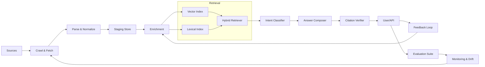

# RRB AI Multi-Agent System Requirements

## 1. Purpose & Scope
Build a modular, multi-agent TypeScript system that ingests authoritative Railway Recruitment Board (RRB) exam information (notifications, syllabus, news), extracts and enriches previous-year questions, and answers user queries via retrieval‑augmented generation (RAG) with strong provenance, evaluation, and scalability. Initial pilot can focus on one exam (e.g., NTPC) and expand gradually.

## 2. Layered Architecture Overview
```
External Sources --> Ingestion --> Normalization --> Enrichment --> Indexing --> Retrieval/RAG --> Delivery & Feedback --> Monitoring/Governance
```
| Layer | Goal | Key Artifacts |
|-------|------|---------------|
| 0 External Sources | Official RRB sites, PDFs, user uploads | Raw HTML/PDF/Docs |
| 1 Ingestion | Fetch + parse + provenance | RawAsset, ParsedNotification |
| 2 Normalization | Canonical DTO validation | Notification, Exam, SyllabusItem, RawQuestion |
| 3 Enrichment | Dedup, tagging, difficulty, quality | Question (enriched), TopicProfile |
| 4 Indexing | Lexical + vector hybrid | RetrievalChunk, EmbeddingVector |
| 5 Retrieval & RAG | Intent routing + answer synthesis | QueryIntent, RankedContext, AnswerPayload |
| 6 Monitoring & Evaluation | Quality, drift, freshness | Metrics, EvaluationReport |
| 7 Delivery | API, UI, admin portal | REST/GraphQL endpoints, Chat session |

## 3. Multi-Agent Role Taxonomy
| Agent | Responsibility | Inputs | Outputs |
|-------|----------------|--------|---------|
| SourceDiscoveryAgent | Registry of sources & crawl cadence | Seed list | Source registry entry |
| NewsCrawlerAgent | Fetch notifications/news | Source registry | RawAsset |
| NotificationParserAgent | Parse HTML/PDF to structured notification | RawAsset | Notification |
| PDFQuestionExtractorAgent | Extract MCQs from PDF layout | RawAsset | RawQuestion[] |
| ManualIngestAgent | Handle user uploads, route to parser | Upload file | RawAsset |
| ProvenanceAgent | Stamp artifacts with URL/hash/time | Parsed item | Provenance metadata |
| DedupAgent | Suppress duplicates (hash + semantic) | RawQuestion[] | UniqueQuestion[] |
| TopicTaggerAgent | Assign topic labels | Question | topics[] |
| DifficultyEstimatorAgent | Compute difficulty level | Question | difficulty |
| QualityScoringAgent | Confidence / clarity scoring | Question | qualityScore |
| ChunkingAgent | Split content for embeddings | Notification/Question | RetrievalChunk[] |
| EmbeddingIndexerAgent | Generate & store embeddings | RetrievalChunk | EmbeddingVector |
| LexicalIndexerAgent | Inverted index/BM25 stats | RetrievalChunk | LexicalIndexData |
| IntentClassifierAgent | Classify user query type | Query text | QueryIntent |
| HybridRetrieverAgent | Lexical + vector fusion | QueryIntent + indexes | RankedContext[] |
| AnswerComposerAgent | Build prompt & synthesize answer | RankedContext[] | DraftAnswer |
| CitationVerifierAgent | Ensure claims map to sources | DraftAnswer + contexts | VerifiedAnswer |
| EvaluationAgent | Benchmark queries & compute metrics | TestSet | EvaluationReport |
| DriftDetectionAgent | Identify syllabus/topic distribution shifts | Historical metrics | DriftAlert |
| SchedulerAgent | Orchestrate periodic runs | Job config | Job execution |
| AlertingAgent | Notify failures/outdated content | Events | Alerts |
| FeedbackLoopAgent | Capture user ratings for improvement | User feedback | Training signals |

## 4. Data Model (Canonical Interfaces)
```ts
export interface Notification {
  id: string; examCodes: string[]; title: string; publishedAt: Date; body: string;
  sourceUrl: string; sourceHash: string; rawType: 'PDF'|'HTML'; topics: string[];
}
export interface Question {
  id: string; examCode: string; year?: number; section?: string; topics: string[];
  stem: string; options: string[]; correctIndex: number; explanation?: string;
  difficulty: 'EASY'|'MEDIUM'|'HARD'; qualityScore: number; sourceUrl: string; sourceHash: string;
}
export interface RetrievalChunk {
  id: string; content: string; kind: 'QUESTION'|'NOTIFICATION'|'SYLLABUS'|'EXPLANATION';
  metadata: Record<string,string|number>; embedding?: number[]; terms?: string[];
}
export interface QueryIntent {
  type: 'INFO'|'PRACTICE'|'STRATEGY'|'META'; confidence: number; originalQuery: string;
}
export interface RankedContext { chunkId: string; score: number; content: string; metadata: Record<string,any>; }
export interface AnswerPayload { text: string; citations: {chunkId: string; sourceUrl: string;}[]; intent: QueryIntent; confidence: number; }
```

## 5. Ingestion Pipeline (Detailed)
1. Source Registry: table with fields (id, url, type, frequency, lastHash, parserType).
2. Crawl Fetch: HTTP GET w/ ETag & Last-Modified headers; fallback exponential backoff.
3. Raw Capture: Persist bytes + metadata; produce hash (SHA256) for change detection.
4. Parse Stage: HTML DOM parsing, PDF text extraction (e.g., pdf.js). Produce canonical DTO.
5. Validation: Zod schema check + minimal content thresholds.
6. Provenance Attach: Add (sourceUrl, sourceHash, fetchedAt, parserVersion).
7. Staging Insert: status='pending'.
8. Promotion: After dedup & enrichment marks status='active'.

## 6. Question Bank Enrichment
- Extraction Heuristics: Regex patterns for numbering, option markers (A|B|C|D), answer key lines.
- Normalization: Lowercase trimming, collapse whitespace, standardize numbering.
- Deduplication: (stemHash + correctOption) primary; semantic threshold using embedding cosine < 0.92.
- Topic Tagging: Stepwise (keywords -> embedding similarity to topic centroids -> fallback classifier).
- Difficulty Estimation: Heuristic combining stem length, option dispersion, multi-step indicator.
- Quality Scoring: Weighted formula: parseConfidence + clarityMetric + (1 - duplicateRisk).
- Storage Partitioning: By exam/year for performance & cost control.

## 7. Indexing & Retrieval
### Chunking
- Notifications: 512–768 token semantic boundaries.
- Syllabus: topic-level nodes.
- Questions: atomic (single chunk).
### Embeddings
- Use AI SDK embedding model; store vectors alongside metadata.
### Lexical Index
- Inverted index: term -> postings list (chunkId, termFreq). Precompute IDF.
### Hybrid Ranking
1. BM25 top N (e.g., 100).
2. Vector similarity top M (e.g., 60).
3. Fusion (reciprocal rank or linear weight): `finalScore = w1*bm25Norm + w2*vectorNorm`.
4. Filter by metadata constraints (examCode, topic, year, difficulty).
### Reranking (Optional)
- Cross-encoder for top K to refine ordering.

## 8. RAG Answer Workflow
1. Intent Classification.
2. Retrieval Plan (branch on intent):
   - INFO: notifications + syllabus.
   - PRACTICE: questions (target difficulty blend).
   - STRATEGY: explanations + curated docs.
   - META: system status/provenance.
3. Context Assembly (rank-sorted chunks trimmed by token budget).
4. Prompt Composition (instructions + JSON citations + context blocks).
5. Generation.
6. Citation Verification (each claim maps to at least one chunkId).
7. Hallucination Mitigation (entity cross-check vs sources; regenerate if threshold exceeded).
8. Response Packaging (AnswerPayload JSON).

## 9. Evaluation & Monitoring
- Metrics: grounding%, retrieval precision@k, hallucination rate, latency p95, drift index, freshness lag.
- Test Sets: Curated queries per intent category.
- Drift Detection: Compare topic distribution (KL divergence month-to-month).
- Freshness: Cron job re-hash source vs lastHash; if changed, schedule reparse.
- Feedback Loop: User rating & error reports feed misclassified intents & wrong answers for retraining.

## 10. Deployment & Scaling Roadmap
| Phase | Focus | Stack |
|-------|-------|-------|
| 1 | Pilot (single exam) | Node scripts + SQLite/JSON |
| 2 | Structured DB + Queue | Postgres + Redis (BullMQ) |
| 3 | Vector Search Scaling | pgvector or dedicated vector DB |
| 4 | Service Separation | Ingestion service + RAG API + Admin UI |
| 5 | Observability | Prometheus + ELK + OpenTelemetry |
| 6 | Advanced QA | Drift alerts, auto retraining |

## 11. ASCII Architecture Diagram
```
+------------------+        +------------------+
|  Official Sites  |        |  User Uploads    |
+---------+--------+        +---------+--------+
          |                           |
          v                           v
    [Ingestion Agents: Crawler / Parser / Upload]
          |                +------------------+
          v                | ProvenanceAgent  |
    [Staging Store] <------+------------------+
          |
          v
    [Enrichment Agents: Dedup, Tag, Difficulty, Quality]
          |
          v
    [Chunking] --> [EmbeddingIndexer] --> [Vector Index]
          |                               
          +--> [LexicalIndexer] ------> [Lexical Index]
                              
                [HybridRetriever]
                       |
                [IntentClassifier]
                       |
                [AnswerComposer]
                       |
                [CitationVerifier]
                       |
                [Delivery Channels]
                       |
                [Feedback & Evaluation]
                       |
                [Monitoring & Drift]
```

## 12. Mermaid System Overview


## 13. Difficulty Estimation (Heuristic Sample)
```ts
function estimateDifficulty(q: Question): 'EASY'|'MEDIUM'|'HARD' {
  const stemLen = q.stem.split(/\s+/).length;
  const dispersion = optionDispersionEmbedding(q.options); // embedding variance
  const multiStep = /calculate|approximate|derive|sum of/i.test(q.stem) ? 1 : 0;
  const score = stemLen*0.2 + dispersion*0.5 + multiStep*2;
  return score < 8 ? 'EASY' : score < 15 ? 'MEDIUM' : 'HARD';
}
```

## 14. Security & Compliance Requirements
- Source Allowlist: Only official RRB domains & explicitly approved portals.
- Provenance Mandatory: All records retain (sourceUrl, hash, fetchedAt).
- Access Control: Admin endpoints gated by role; user queries rate-limited.
- Legal Review: If rights unclear for past papers, store metadata + link only.
- Audit Logging: Structured logs per agent action (start, success, failure).
- PII Avoidance: Strip any personal data from user-uploaded documents.

## 15. Performance Targets (Initial)
| Metric | Target |
|--------|--------|
| Retrieval Latency (95p) | < 1200ms end-to-end |
| Grounding Score | > 0.85 |
| Hallucination Rate | < 0.05 |
| Freshness Lag (Notifications) | < 24h |
| Duplicate Rate (Questions) | < 2% |

## 16. Extensibility Considerations
- Pluggable Parsers via strategy interface.
- Abstract EmbeddingProvider for future model changes.
- Index Update Strategy: Batch incremental + nightly full rebuild option.
- Multi-Language Support: Tokenizer abstraction; later add Hindi regional content.

## 17. Risks & Mitigations
| Risk | Impact | Mitigation |
|------|--------|-----------|
| Source site HTML change | Parsing failure | Versioned parser + fallback manual review |
| Copyright constraints | Legal exposure | Metadata-only storage policy fallback |
| Hallucinations | User mistrust | Strict citation verification + claim filtering |
| Topic drift | Outdated recommendations | DriftDetectionAgent triggers retag + review |
| Latency spikes | Poor UX | Caching, asynchronous rerank, load shedding |

## 18. Roadmap (Summary)
1. Schema + manual ingestion pilot.
2. Question extraction + enrichment.
3. Hybrid retrieval + basic RAG.
4. Evaluation harness + feedback loop.
5. Automation (scheduled crawls + drift detection).
6. Scaling (services split, advanced observability).

## 19. Acceptance Criteria (MVP)
- Can ingest at least 5 official notifications with provenance.
- Build question bank of ≥ 200 unique, tagged questions.
- Answer info/practice queries with ≥ 80% grounding score.
- Provide citations linking to sourceUrl for each claim cluster.
- User feedback stored & visible in admin dashboard stub.

## 20. Open Questions
- Licensing of older question papers beyond public domain? (Needs legal review.)
- Strategy for multi-lingual expansion order? (Hindi next?)
- Cross-encoder reranker necessity at MVP scale?
- Data retention policy for user queries & feedback metrics duration?

---
End of Requirements Document.
